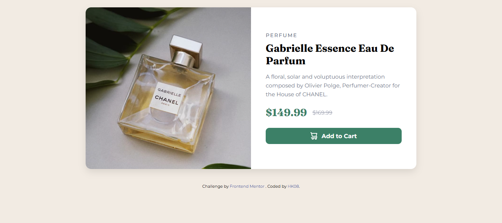
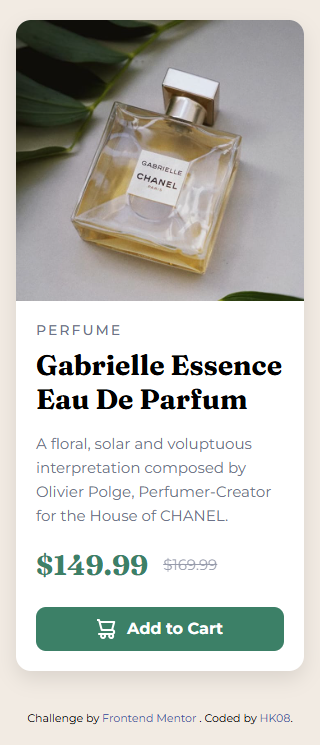

# Gabrielle Essence Product Card

A responsive **product preview card** built from a Frontend Mentor challenge. This project demonstrates clean HTML, organized CSS, and a mobile-first design approach with an exact 50/50 split on desktop screens.  

## Features

- **Responsive Design:** Mobile-first layout that scales seamlessly to desktop.  
- **Clean HTML & CSS:** Semantic structure, well-organized styles.  
- **Desktop 50/50 Split:** Image and text columns occupy exactly 50% each.  
- **SEO-Friendly:** Meta description, keywords, alt text, and accessible button.  
- **Interactive CTA:** Add-to-cart button with hover transition and icon.  

## Screenshot

  
  

## Technologies Used

- HTML5  
- CSS3 (Flexbox, Media Queries)  
- Google Fonts (Montserrat & Fraunces)  

## How to Use

1. Clone the repository:  
   ```bash
   git clone https://github.com/yourusername/product-card.git
